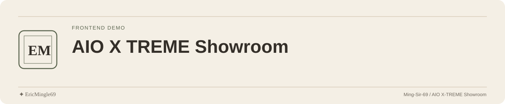

<picture>
  <source media="(prefers-color-scheme: dark)" srcset="readme-assets/header-dark.svg">
  <source media="(prefers-color-scheme: light)" srcset="readme-assets/header-light.svg">
  
</picture>

<p align="center">
  <a href="README.md">简体中文</a> · <a href="README.en.md">English</a> · <a href="PERSONAL-NOTICE.md">✦ EricMingle69</a>
</p>

# AIO X-TREME Showroom

An all-in-one liquid-cooler showroom experiment built with React, TypeScript and Vite.
The interface offers Chinese, English and Vietnamese, with brand/product selection, specification panels and theme switching.

**Prices and specifications are demo data**: `generateSpecs()` produces specifications and prices are static values, not purchasing guidance or official product specifications.

## View locally

Prepare Node.js and npm, then run from the repository root:

```sh
npm install
npm run dev
```

Vite is configured for port `3000`; use the address printed by the terminal.
The current page uses local display data and does not require a Gemini key for local viewing.

## Build and preview

```sh
npm run build
npm run preview
```

Availability of external images and other resources may affect the display.

## Explore the files

| File | Contents |
| --- | --- |
| [App.tsx](App.tsx) | Interactions and page components |
| [constants.ts](constants.ts) | Three languages and demo product data |
| [types.ts](types.ts) | Data types |
| [package.json](package.json) · [vite.config.ts](vite.config.ts) | Dependencies, scripts and development server |

## Original entry and scope

The project has an [AI Studio app entry](https://ai.studio/apps/drive/16qPAXZwGodMRXrRyjoLsEQxHa2X4dQUh); access is controlled by AI Studio.
The template reserves Gemini environment definitions; future service integration needs separate confirmation.
No LICENSE covers the original code and resources. Brands and third-party resources retain their attribution.

---

Documentation maintained by **✦ EricMingle69** · [Ming-Sir-69](https://github.com/Ming-Sir-69)  
[Personal identity, licensing and permissions](PERSONAL-NOTICE.md) · The header follows your GitHub theme.
